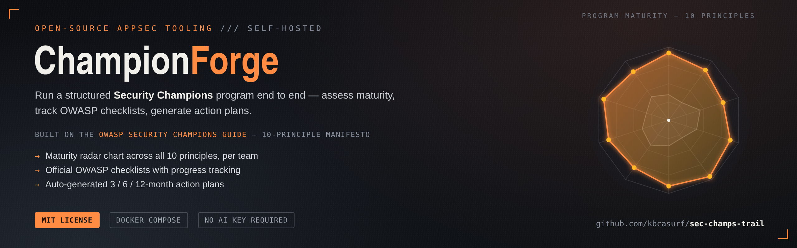

# ChampionForge



Open-source tool to help organizations build, run, and mature Security Champions
programs, using the **OWASP Security Champions Guide** (10-principle Manifesto +
official checklists) as its backbone. See `PRD-security-champions-assistant.md` for the
full product vision and `ROADMAP.md` for the current status of each phase.

## Status

**Phase 0 (Foundation), Phase 1a (MVP without AI), and Phase 1b (AI layer): implemented.**
The product is fully usable end to end **without** any AI key configured — champion
program maturity assessment, checklist library, and a rule-based action plan, all
described below. With an AI provider key configured (optional — see "AI-powered
features" under Quickstart), two more features become available: a Training Track
Generator and an Executive Report. Details:
`ROADMAP.md`, `docs/superpowers/plans/2026-08-10-fase0-fundacao-execution-log.md`,
`docs/superpowers/plans/2026-08-13-fase1a-mvp-execution-log.md`, and
`docs/superpowers/plans/2026-08-19-fase1b-ai-layer.md`.

**UI design system: implemented.** All six screens (Login, Dashboard, New assessment,
Checklist, Action plan, Teams) share a dark, branded visual identity instead of
unstyled Tailwind defaults — see [Design](#design) below and
[ADR 0003](docs/adr/0003-application-design-system.md).

## Current features

Important: **this is not an SDLC/code maturity assessment tool** (that's already the
role of other tools in the portfolio, such as SAMMwise-ai, based on OWASP SAMM).
ChampionForge measures the maturity of **how the organization recruits, trains, and
retains security champions** — the 10 principles of the OWASP Security Champions Guide
Manifesto — not the security posture of the code teams produce.

- **Authentication** — local email/password login (JWT in an `httpOnly` cookie). There
  is no public sign-up; the first administrator is created via a bootstrap script (see
  Quickstart), and subsequent administrators/champions are created through the UI
  itself.
- **Team and Champion administration** *(admin)* — at `/teams`: create Teams, create
  Champions, and assign them to a Team. A `Champion` with the `champion` role always
  needs to be associated with a Team; administrators can exist without a Team (they
  oversee all of them).
- **Program Maturity Assessment** *(F1, at `/assessment/new` and `/dashboard`)* — a
  10-question questionnaire (one per Manifesto principle), each answered on a 0-4 scale
  with its own per-level description. The assessment is per Team, and each submission
  creates a new historical snapshot (retaking the assessment never deletes the previous
  one). The dashboard shows a radar chart of the team's most recent snapshot (admins
  choose which team to view).
- **Checklist Library** *(F4, at `/checklist`)* — all official OWASP checklists,
  browsable by principle and by lifecycle phase (recruitment / development and
  retention), with a per-item progress checkbox, per Team.
- **Rule-based Action Plan** *(simplified F2, at `/action-plan`)* — from the team's most
  recent assessment snapshot, generates a roadmap across three horizons (3, 6, and 12
  months), prioritizing the principles with the lowest maturity. It's deterministic (no
  AI): the 3 weakest principles go into the 3-month bucket, the next 3 into the 6-month
  bucket, and the 4 strongest into the 12-month bucket. Regenerating the plan never
  resets progress already marked in the checklist library — the two are independent.
- **Training Track Generator** *(F3, at `/training-tracks`, requires an AI provider
  key)* — from a team's tech stack, experience level, and available hours per week,
  generates a personalized study track: a set of prioritized modules, each with key
  concepts, hands-on exercises, and a reinforcement quiz. Available to both admins and
  champions.
- **Executive Report** *(F5, at `/executive-reports`, admin only, requires an AI
  provider key)* — an executive-language report generated from every team's maturity
  and checklist-completion data, meant to help justify continued investment in the
  program to leadership.

Both AI-powered features require the user to acknowledge a data-sharing consent notice
before each generation, show a disabled "Generating…" state on their button for the
duration of the request, render the result as formatted content (headings, lists, bold
text — not raw Markdown syntax), and can be exported to Markdown or PDF.

## Design

The app's visual identity extends the one already established by the README banner
above: a dark surface, a single orange accent, and a three-font pairing — **Space
Grotesk** for headings, **IBM Plex Sans** for body text, **IBM Plex Mono** for
technical/UI labels (nav, badges, buttons). Color and font tokens live in
`apps/web/tailwind.config.js` (`theme.extend.colors` / `fontFamily`); the fonts load
via Google Fonts in `apps/web/index.html`, each with a system-font fallback stack.

There is no separate component library — every screen is plain Tailwind utility
classes on native HTML elements (real `<input type="radio">`/`type="checkbox">`, not
`<div>`-based custom controls), restyled but not replaced, so existing keyboard and
screen-reader behavior is preserved. The full rationale, alternatives considered, and
consequences are recorded in
[ADR 0003 — Application UI design system](docs/adr/0003-application-design-system.md).

## How to use it (step by step)

1. After bootstrapping (Quickstart below), log in at `http://localhost:3000` with the
   admin email/password.
2. Under **Teams**, create a Team for the group that will use the program.
3. Still under **Teams**, create a Champion (email/password), assigned to that Team.
   That champion (or the admin) can then log in and complete that team's assessment.
4. Logged in as that champion (or as an admin, who can view any team), go to **New
   assessment** and answer the 10 questions.
5. See the result under **Dashboard** (radar chart).
6. Under **Action plan**, click "Generate new plan" to generate the prioritized roadmap.
7. Under **Checklist**, check off item progress as it gets implemented — this progress
   is reflected in the action plan and survives a plan regeneration.
8. If an AI provider key is configured (see "AI-powered features" under Quickstart),
   under **Training track**, describe the team's tech stack and experience level and
   click "Generate track" for a personalized study track.
9. As an admin, under **Executive report**, click "Generate report" for an
   executive-language summary of every team's maturity, ready to share with leadership.

## Quickstart

1. Copy the environment variable template and fill in the required secrets:

   ```bash
   cp .env.example .env
   ```

   At minimum, set `JWT_SECRET` (32+ characters, no default value — generate one with
   `openssl rand -base64 32`) and `ADMIN_EMAIL`,
   `ADMIN_PASSWORD`, `ORGANIZATION_NAME` (used to bootstrap the first admin in step 3).
   `WEB_ORIGIN` already comes pre-filled with `http://localhost:3000`, the app's own
   origin under Docker Compose (see [ADR 0002](docs/adr/0002-single-docker-image.md)) —
   you only need to change it if you change that port.

2. Bring up the stack (Postgres + app — api and web are a single image, see
   [ADR 0002](docs/adr/0002-single-docker-image.md)). There are two ways to get the
   `app` image, pick one:

   - **Pull the pre-built image** from GitHub Container Registry (published
     automatically on every push to `main`, see
     [`.github/workflows/docker-build-push.yml`](.github/workflows/docker-build-push.yml)) —
     fastest, no local build required:

     ```bash
     docker compose pull
     docker compose up -d
     ```

   - **Build the image locally** from source — use this if you changed application
     code and want to test it:

     ```bash
     docker compose up --build -d
     ```

   The app runs the Prisma migrations and seeds the curated OWASP content
   (`Principle`/`ChecklistItem`/`PrincipleMaturityLevel`) automatically on boot.

3. Create the Organization and the first admin (only needs to run once per instance —
   there's no public route for this, by design):

   ```bash
   docker compose exec app node dist/src/bootstrap/bootstrap-admin.js
   ```

   Reads `ADMIN_EMAIL`, `ADMIN_PASSWORD`, and `ORGANIZATION_NAME` from the environment.
   (This is the compiled equivalent of `npm run bootstrap:admin` — the production image
   doesn't include `ts-node`, which that script needs.)

4. Verify it's up:
   - API health check: `GET http://localhost:3000/api/health`
   - Web app: `http://localhost:3000`

5. Log in with the admin email/password and follow the step-by-step guide in the
   section above.

### Resetting the local environment

To wipe the database (loses all data) and start over from scratch:

```bash
docker compose down -v
docker compose up --build -d
docker compose exec app node dist/src/bootstrap/bootstrap-admin.js
```

### Local HTTPS (optional)

`docker-compose.https.yml` runs the same stack behind a local Caddy reverse proxy on
ports 80/443, terminating TLS with Caddy's own internal certificate authority — modeled
on [threat-dragon-ai's Caddy setup][td-caddy]. This is the way to exercise these headers
over real TLS in a browser — the default `docker-compose.yml` stack already sends the
`Secure` cookie flag and HSTS header (the production Docker image always runs with
`NODE_ENV=production`), but only a real HTTPS connection lets a browser actually honor
them; over plain HTTP, `Secure` cookies and `upgrade-insecure-requests` only work at all
because browsers make a `localhost`-specific exception.

This stack also sets `TRUST_PROXY_HOPS=1` (see `.env.example`), because Caddy sits in
front of the app as a single reverse-proxy hop. The same rule applies to any real
deployment: when the app runs behind a reverse proxy, set `TRUST_PROXY_HOPS` to the
exact number of proxy hops in front of it — never guess high, and never set it without
an actual proxy there, since either mistake lets a client spoof `X-Forwarded-For` to
rewrite its own rate-limit identity. Leave it unset (the default) whenever the app is
reachable directly, with no proxy in front.

```bash
docker compose -f docker-compose.https.yml up --build
```

Then open `https://localhost`. The browser will show a certificate warning — Caddy can't
install its internal CA into the host's trust store from inside a container, so this is
expected, not a bug. Either click through the warning, or trust it properly:

```bash
docker compose -f docker-compose.https.yml exec caddy cat /data/caddy/pki/authorities/local/root.crt > /tmp/caddy-local-ca.crt
```

and import `/tmp/caddy-local-ca.crt` into your OS or browser's trust store.

[td-caddy]: https://github.com/kbcasurf/threat-dragon-ai

### AI-powered features (optional)

Training Track Generator and Executive Report (see `docs/superpowers/specs/2026-08-19-fase1b-ai-layer-design.md`)
require an AI provider API key. Without one, both features stay visible in the app but
show a message instead of a generation form -- every other feature works exactly the
same either way. To enable them, set `AI_PROVIDER_API_KEY` in `.env` (see
`.env.example` for the full set of `AI_PROVIDER_*` variables, all optional beyond the
key itself) and restart the stack. `AI_PROVIDER_API_URL`, if set, must start with
`https://`. The app never calls out to an AI provider on its own -- only when a user
explicitly clicks "Generate" after acknowledging the consent notice, and every
AI-generated result is labeled as such in the UI. While a generation request is in
flight the button shows a disabled "Generating…" state (a real call typically takes
15-35 seconds); the result renders as formatted content, not raw Markdown syntax, and
can be exported to Markdown or PDF from the same page.

### Running without Docker (development)

Requires Node.js ≥20 and a Postgres instance reachable via `DATABASE_URL`.

```bash
npm install
npm run build -w packages/owasp-content  # required once — apps/api imports its compiled
                                          # output, not its raw TypeScript (see ADR 0002)
npm run db:migrate:deploy -w apps/api
npm run db:generate -w apps/api
npm run db:seed -w apps/api
npm run bootstrap:admin -w apps/api
npm run start:dev -w apps/api   # API on :3000, routes under /api
npm run dev -w apps/web         # Web on :5173 (another terminal)
```

Here the api (`:3000`) and web dev server (`:5173`) are different origins, so
`apps/web`'s `VITE_API_URL` needs the full URL (`.env.example` already sets
`http://localhost:3000/api`) — unlike the single Docker image, which serves both from
the same origin and doesn't need it (see [ADR 0002](docs/adr/0002-single-docker-image.md)).
